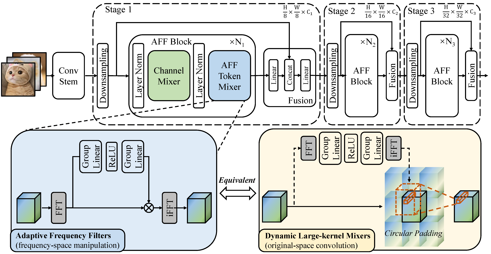

<a href="https://arxiv.org/abs/2307.14008"></a>
<a href="https://arxiv.org/abs/2307.14008"></a> 

# Adaptive Frequency Filters As Efficient Global Token Mixers (ICCV 2023)

This repo is the official implementation of "*[Adaptive Frequency Filters As Efficient Global Token Mixers](https://arxiv.org/abs/2307.14008)*", by Zhipeng Huang, Zhizheng Zhang, Cuiling Lan, Zheng-Jun Zha, Yan Lu, Baining Guo


**AFFNet** is a lightweight neural network designed for efficient deployment on mobile devices, achieving superior accuracy and efficiency trade-offs compared to other lightweight network designs on a wide range of visual tasks, including visual recognition and dense prediction tasks. AFFNet, AFFNet-T and AFFNet-ET achieve 79.8\%, 77.0\% and 73.0\% top-1 accuracy on ImageNet-1K dataset.



### Models/logs/configs {#models-head}

#### ImageNet-1K

| name | size |acc@1(%) | #params | FLOPs | download |
|:---:|:---:|:---:| :---:| :---:|:---:|
| AFFNet-ET | 256 $\times$ 256 | 73.0 | 1.4M | 0.4G | [model/log/config](https://1drv.ms/f/s!AjKVODXuNei2gRohpLEiih31-T24?e=KSOEZ5)|
| AFFNet-T | 256 $\times$ 256 | 77.0 | 2.6M | 0.8G | [model/log/config](https://1drv.ms/f/s!AjKVODXuNei2gR3bxUACGV1s-NCt?e=WrEVTC)|
| AFFNet | 256 $\times$ 256 | 79.8 | 5.5M | 1.5G | [model/log/config](https://1drv.ms/f/s!AjKVODXuNei2gRckRc6eJ4kB8dW3?e=7comla)|


#### ADE20K
| name | size | mIOU(%) | #params | download |
|:---:|:---:|:---:| :---:| :---:|
| AFFNet-ET + deeplab | 256 $\times$ 256 | 33.0 | 2.2M | [model/log/config](https://1drv.ms/f/s!AjKVODXuNei2gRuknb2AkG0rFxtY?e=2aitPh)|
| AFFNet-T + deeplab | 256 $\times$ 256 | 36.9 | 3.5M | [model/log/config](https://1drv.ms/f/s!AjKVODXuNei2gRuknb2AkG0rFxtY?e=2aitPh)|
| AFFNet + deeplab | 256 $\times$ 256 | 38.4 | 6.9M | [model/log/config](https://1drv.ms/f/s!AjKVODXuNei2gRiSzBrJqE2SVAex?e=JHeo5F)|

#### VOC
| name | size | mIOU(%) | #params | download |
|:---:|:---:|:---:| :---:| :---:|
| AFFNet-ET + deeplab | 256 $\times$ 256 | 76.1 | 2.2M | [model/log/config](https://1drv.ms/f/s!AjKVODXuNei2gRyIz-KLsycCaWkJ?e=4w4De0)|
| AFFNet-T + deeplab | 256 $\times$ 256 | 77.8 | 3.5M | [model/log/config](https://1drv.ms/f/s!AjKVODXuNei2gR9_2V1Qn9QNgErc?e=YpCuKX)|
| AFFNet + deeplab | 256 $\times$ 256 | 80.5 | 6.9M | [model/log/config](https://1drv.ms/f/s!AjKVODXuNei2gRnr638DY4MgJyoL?e=ycqVco)|


### Install
 

1. Clone the repository:
```bash
git clone https://github.com/microsoft/TokenMixers.git
cd TokenMixers/AFFNet/
```

2. Prepare the base enviroment, we use ubuntu20, python3.8, and cuda11.5. 8 A100 GPUs are used for training and evaluation.

3. Install required packages:
```bash
conda create -fyn ml-cvnets python=3.8
python -m pip install wandb ptflops einops
python -m pip install -r requirements.txt
python -m pip install psutil torchstat tqdm
python -m pip install --editable .
python -m pip install --upgrade fvcore
python -m pip install complexPyTorch
```

### Data preparation

Download the standard ImageNet-1K dataset from [http://image-net.org](http://image-net.org), ADE20K dataset from [https://groups.csail.mit.edu/vision/datasets/ADE20K/](https://groups.csail.mit.edu/vision/datasets/ADE20K/), and VOC dataset from [http://host.robots.ox.ac.uk/pascal/VOC/](http://host.robots.ox.ac.uk/pascal/VOC/) and construct the data like:
```bash
Dataset_Root  
├── ImageNet  
│   ├── train  
│   │   ├── n01440764  
│   │   │   ├── n01440764_10026.JPEG  
│   │   │   ├── n01440764_10027.JPEG  
│   │   │   ├── ...  
│   │   ├── ...  
│   ├── val  
│   │   ├── n02093754  
│   │   │   ├── ILSVRC2012_val_00000832.JPEG  
│   │   │   ├── ILSVRC2012_val_00003267.JPEG  
│   │   │   ├── ...  
│   │   ├── ...  
├── ADEChallengeData2016  
│   ├── annotations  
│   ├── images  
│   ├── objectinfo150.txt  
│   ├── sceneCategories.txt  
├── VOCdevkit  
    ├── rec_data  
    ├── VOC2007  
    ├── VOC2012  

```


### Training
run the following command to train the model on 8 A100 GPUs Node:
```bash
python main_train.py --log-wandb --common.config-file <config_path> --common.results-loc <save_path>
```
replace the `<config_path>` with the path of the config file (you can get from [here](#modelslogsconfigs-models-head) ), and `<save_path>` with the path to save the model and log files.

### Evaluation
run the following command to evaluate the model on 8 A100 GPUs Node:
```bash
python main_eval.py --common.config-file <config_path>  --common.results-loc <save_path> --model.classification.pretrained <model_path>
```
replace the `<config_path>` with the path of the config file (you can get from [here](#modelslogsconfigs-models-head) ), `<save_path>` with the path to save the model and log files, and `<model_path>`(you can get from [here](#modelslogsconfigs-models-head)) with the path of the pretrained model.


## Citing
If you find this code and work useful, please consider **citing** the following paper and **star** this repo. Thank you very much!
```
@inproceedings{huang2023adaptive,
  title={Adaptive Frequency Filters As Efficient Global Token Mixers},
  author={Huang, Zhipeng and Zhang, Zhizheng and Lan, Cuiling and Zha, Zheng-Jun and Lu, Yan and Guo, Baining},
  booktitle={ICCV},
  year={2023}
}
```
 

### Contributing

This project welcomes contributions and suggestions.  Most contributions require you to agree to a
Contributor License Agreement (CLA) declaring that you have the right to, and actually do, grant us
the rights to use your contribution. For details, visit https://cla.opensource.microsoft.com.

When you submit a pull request, a CLA bot will automatically determine whether you need to provide
a CLA and decorate the PR appropriately (e.g., status check, comment). Simply follow the instructions
provided by the bot. You will only need to do this once across all repos using our CLA.

This project has adopted the [Microsoft Open Source Code of Conduct](https://opensource.microsoft.com/codeofconduct/).
For more information see the [Code of Conduct FAQ](https://opensource.microsoft.com/codeofconduct/faq/) or
contact [opencode@microsoft.com](mailto:opencode@microsoft.com) with any additional questions or comments.

### Trademarks

This project may contain trademarks or logos for projects, products, or services. Authorized use of Microsoft 
trademarks or logos is subject to and must follow 
[Microsoft's Trademark & Brand Guidelines](https://www.microsoft.com/en-us/legal/intellectualproperty/trademarks/usage/general).
Use of Microsoft trademarks or logos in modified versions of this project must not cause confusion or imply Microsoft sponsorship.
Any use of third-party trademarks or logos are subject to those third-party's policies.

